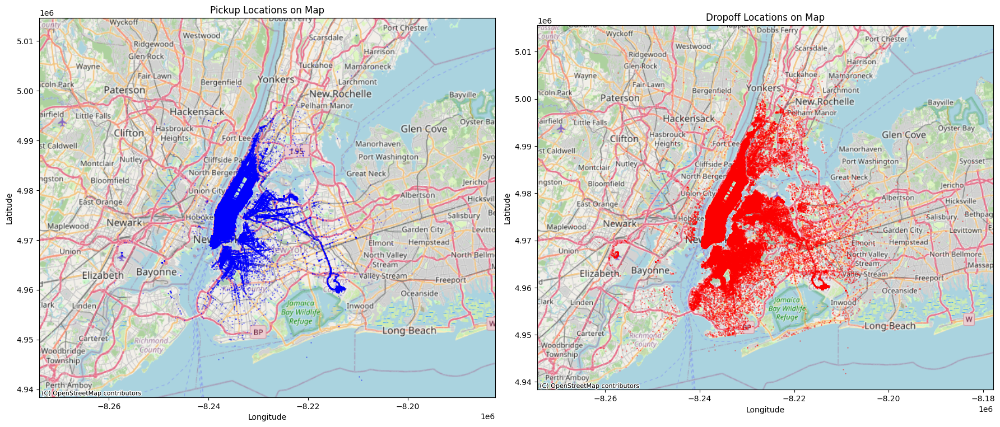
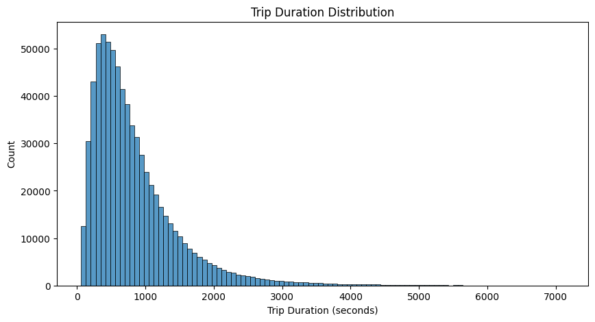
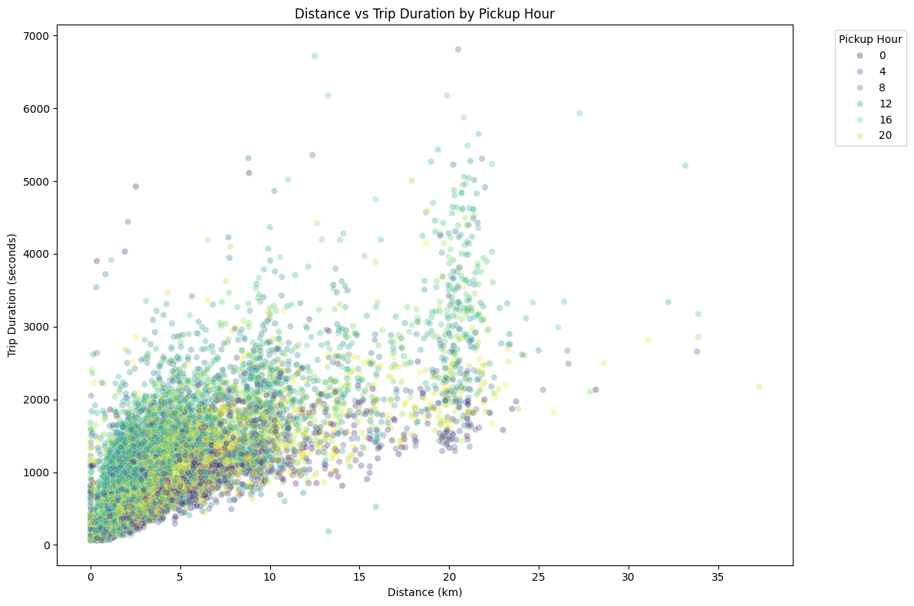
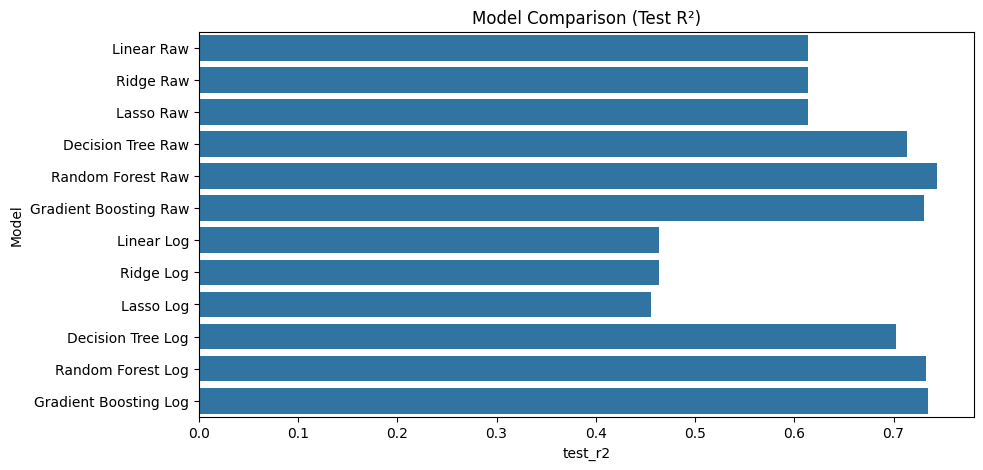
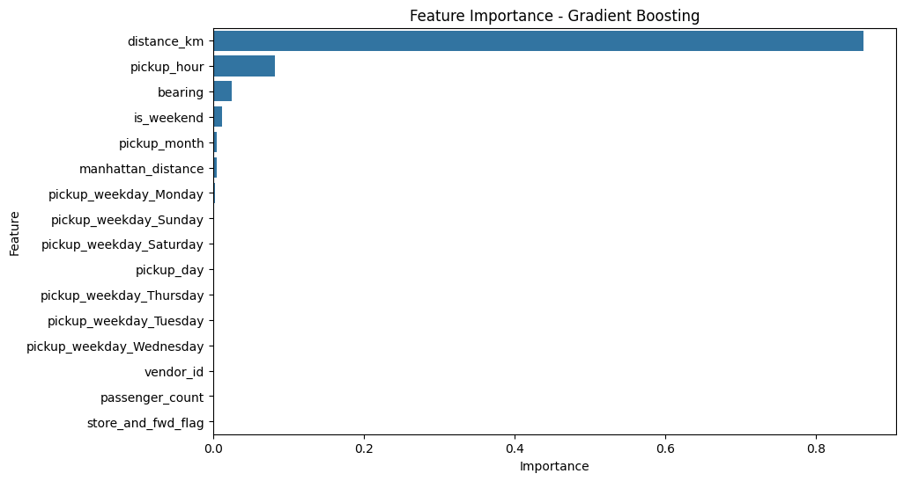
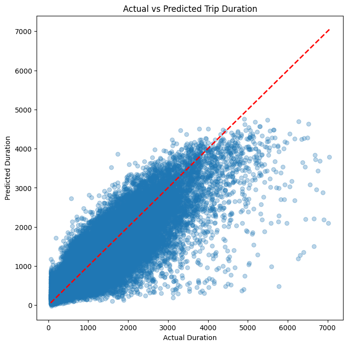

# 🚖 NYC Taxi Trip Duration Prediction using Geospatial Feature Engineering and Gradient Boosting

## 📌 Project Overview

Accurate trip duration prediction is a critical component of modern ride-hailing and taxi dispatch systems. Reliable travel time estimates improve customer experience, support efficient driver allocation, and enable better fleet utilization.

In this project, I developed an end-to-end machine learning pipeline to predict New York City taxi trip durations using temporal and geospatial trip information. The project covers data cleaning, exploratory data analysis, feature engineering, model comparison, feature selection, cross-validation, hyperparameter tuning, and final model optimization.

The final optimized Gradient Boosting model achieved a **Test R² Score of 0.763** while maintaining strong generalization performance.

---

## 🎯 Business Problem

Ride-hailing platforms such as Uber and Lyft need accurate estimates of trip duration to:

* Improve ETA predictions
* Optimize driver dispatching
* Increase fleet utilization
* Reduce passenger waiting time
* Improve customer satisfaction

The objective of this project is to build a machine learning model capable of predicting trip duration using information available at the beginning of a trip.

---

## 📂 Dataset

**Dataset:** NYC Taxi Trip Duration Dataset

The dataset contains information about taxi trips including:

* Pickup and dropoff timestamps
* Pickup and dropoff coordinates
* Passenger count
* Vendor information
* Store-and-forward flag
* Trip duration (target variable)

### Dataset Size

| Stage            | Records |
| ---------------- | ------: |
| Original Dataset | 729,322 |
| Cleaned Dataset  | 723,758 |

---

## 🔧 Project Workflow

```text
Data Collection
      ↓
Data Cleaning
      ↓
Exploratory Data Analysis
      ↓
Feature Engineering
      ↓
Model Development
      ↓
Model Comparison
      ↓
Feature Selection
      ↓
Cross Validation
      ↓
Hyperparameter Tuning
      ↓
Final Model
      ↓
Business Insights
```

---

# 📊 Exploratory Data Analysis

## Geographic Distribution of Trips

The geographic analysis revealed a strong concentration of taxi activity around Manhattan and surrounding boroughs.

**Figure: Pickup and Dropoff Location Density Map**




These spatial patterns motivated the creation of geospatial features such as travel distance, Manhattan distance, and trip bearing.

---

## Target Variable Distribution

Trip duration exhibited significant positive skewness.

* Skewness: 2.20
* Kurtosis: 7.70

A logarithmic transformation was evaluated to reduce skewness and stabilize variance.

**Figure: Trip Duration Distribution**



---

### Distance vs Trip Duration by Pickup Hour

The relationship between travel distance and trip duration is strongly positive. However, trips of similar distances often exhibit substantially different durations depending on the pickup hour, reflecting the impact of traffic congestion and travel demand throughout the day.

This observation motivated the inclusion of temporal features such as pickup hour and weekend indicators, which significantly improved model performance.

Correlation:

```text
Distance vs Trip Duration = 0.771
```

**Figure: Distance vs Trip Duration**



---

# ⚙️ Feature Engineering

Several temporal and geospatial features were engineered to improve model performance.

### Temporal Features

* pickup_hour
* pickup_day
* pickup_month
* pickup_weekday
* is_weekend

### Geospatial Features

* Haversine Distance
* Manhattan Distance
* Bearing

### Encoded Features

* Store-and-forward flag
* Weekday dummy variables

---

# 🤖 Models Evaluated

The following regression algorithms were compared:

1. Linear Regression
2. Ridge Regression
3. Lasso Regression
4. Decision Tree Regressor
5. Random Forest Regressor
6. Gradient Boosting Regressor

Both raw and log-transformed target variables were investigated.

---

# 📈 Model Comparison

### Model Performance Summary

| Model             | Test R² |
| ----------------- | ------: |
| Linear Regression |   0.614 |
| Ridge Regression  |   0.614 |
| Lasso Regression  |   0.614 |
| Decision Tree     |   0.714 |
| Random Forest     |   0.744 |
| Gradient Boosting |   0.730 |

**Figure: Model Comparison**



### Key Findings

* Tree-based models significantly outperformed linear models.
* Regularization provided minimal improvement over Linear Regression.
* Random Forest achieved the highest baseline accuracy.
* Gradient Boosting demonstrated superior generalization.

---

# 🔍 Feature Importance Analysis

Feature importance analysis was performed using the selected Gradient Boosting model.

| Feature     | Importance |
| ----------- | ---------: |
| distance_km |      0.863 |
| pickup_hour |      0.082 |
| bearing     |      0.025 |
| is_weekend  |      0.012 |

**Figure: Feature Importance**



### Observation

Distance alone accounted for approximately **86%** of the model's predictive importance, confirming the findings from exploratory analysis.

---

# 🎯 Feature Selection

A simplified model using only:

* distance_km
* pickup_hour
* bearing
* is_weekend

retained approximately **99%** of the predictive performance achieved by the full-feature model.

This demonstrates that trip duration prediction is driven primarily by a small set of temporal and geospatial variables.

---

# ✅ Model Validation

## Cross Validation

10-fold cross-validation was performed on the selected model.

| Metric             | Value |
| ------------------ | ----: |
| Mean R²            | 0.726 |
| Standard Deviation | 0.008 |

The low variance across folds indicates strong model stability and generalization.

---

# 🚀 Hyperparameter Tuning

Grid Search was used to optimize the Gradient Boosting Regressor.

### Best Parameters

```python
{
    'learning_rate': 0.1,
    'max_depth': 5,
    'n_estimators': 200
}
```

Best Cross-Validation Score:

```text
0.752
```

---

# 🏆 Final Model Performance

The optimized Gradient Boosting model was retrained using the complete cleaned dataset.

| Metric      |                             Value |
| ----------- | --------------------------------: |
| Model       | Tuned Gradient Boosting Regressor |
| Training R² |                             0.768 |
| Testing R²  |                             0.763 |
| MAE         |                    207.89 seconds |
| RMSE        |                    316.11 seconds |

### Actual vs Predicted Performance



The model explains approximately **76% of the variation in taxi trip duration** while maintaining strong generalization performance.

---

# 💡 Business Insights

### Insight 1

Travel distance is the dominant factor affecting trip duration.

### Insight 2

Traffic congestion during peak commuting hours significantly impacts travel time.

### Insight 3

Weekday trips are generally longer and more frequent than weekend trips.

### Insight 4

Travel direction contributes additional predictive information, indicating route-specific traffic patterns.

### Insight 5

A small subset of carefully engineered features captures most of the predictive power.

### Insight 6

Machine learning can improve ETA prediction, dispatch efficiency, and fleet utilization.

---

# 🛠️ Technologies Used

* Python
* Pandas
* NumPy
* Matplotlib
* Seaborn
* Scikit-Learn
* Jupyter Notebook

---

# 📁 Repository Structure

```text
NYC-Taxi-Trip-Duration-Prediction/
│
│
├── dataset/
│   └── nyc_taxi_trip_duration.csv
│
├── notebook/
│   └── NYC_Taxi_Trip_Duration_Prediction.ipynb
│
├── images/
│   ├── pickup_and_dropoff_density_map.png
│   ├── distance_vs_duration.png
│   ├── feature_importance.png
│   ├── model_comparison.png
│   └── actual_vs_predicted.png
│
├── report/
│   └── Project_Report.pdf
│
├── requirements.txt
│
└── README.md
```

---

# 🔮 Future Improvements

Potential future enhancements include:

* Integration of real-time traffic information
* Incorporation of weather data
* Route-based congestion modeling
* XGBoost, LightGBM, and CatBoost implementation
* Real-time deployment through a web application or API
* Geographic clustering and advanced spatial feature engineering

---

# 📚 Key Learning Outcomes

This project demonstrates:

* End-to-end machine learning workflow development
* Geospatial feature engineering
* Regression model comparison and evaluation
* Feature importance and feature selection techniques
* Cross-validation and hyperparameter optimization
* Translation of machine learning results into business insights

The project highlights how machine learning can be applied to transportation analytics to improve operational decision-making and customer experience.
